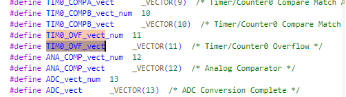

# Lập trình Attiny24A
**=========== Mục Lục =============**
- [Code cơ bản về attiny24A](#code-cơ-bản-về-attiny24a)
- [GPIO](#1-gpio)
- [Timer](#2-timer)
- [Ngắt ngoài](#3-external-interrupt)
- [PWM](#4-pwm)
- [CTC Mode](#5-clear-on-compare-matchctc)
- [ADC](#6-adc)
- [EEPROM](#7-eeprom)
IDE Lập trình : Microchip Studio\
Mạch nạp : USB ISP 3.0\
Phần mềm nạp : Progisp 1.7

Attiny24A là vi điều khiển thuộc họ AVR của hãng ATMEL với giá thành rẻ được trang bị 2KB bộ nhớ Flash 128byte EEPROM và 128 byte SRAM, 4 kênh PWM, 2 timer 8 bit và 1 timer 16 bit, tần số dao động nội là 8MHz

**Mua Attiny24A tại shop sau:**
<https://icdayroi.com/attiny24a-ssu>\
**Attiny24A có 14 chân và đóng gói dạng SOP**

- Trước kia lập trình mình sử dụng Microchip Studio tuy nhiên phần mềm về sau khá nặng mà nhu cầu chỉ lập trình cho Attinty24A làm project nhỏ nên mình đã sử dụng compile **avr-gcc** có sẵn khi cài Arduino, đường dẫn đến compiler trên máy mình như sau:

        "E:\Documents\Arduino\arduino-1.8.19\hardware\tools\avr\bin\avr-gcc"
        "E:\Documents\Arduino\arduino-1.8.19\hardware\tools\avr\bin\avr-objcopy"
- Vì sử dụng Arduino bản 1.8.19 nên đường dẫn như trên, ngoài sử dụng compile thì mình dùng thêm **makefile** để tiện cho việc build chương trình. Cấu trúc 1 file template đơn giản để lập trình khá đơn giản, không nhiều file như phần mềm Microchip Studio.

Một thư mục Template cơ bản như sau:

        Template
            |- main.c
            |- makefile
            |- main.hex
            |- main.o
            |- main.elf
            |- lib.c
            |- lib.h
            |README --> THIS FILE
- Cấu trúc chỉ đơn giản như vậy, nếu có library thì mình thêm vào thư mục, các file sau biên dịch cũng nằm trong thư mục để cây thư mục đơn giản không nhiều folder, tiện cho mình theo dõi.


# Code dùng trình biên dịch avr-gcc từ arduino để biên dịch cho Attiny24A

    
**Trong file main.c sẽ khai báo tên chip sử dụng, tần số hoạt động**


**Code**

```c
#define __AVR_ATtiny24A__
#define F_CPU 8000000UL   //khai bao thach anh de su dung thu vien delay
#include <avr/io.h>
#include <util/delay.h>
#include <avr/interrupt.h>
#include "lib.h"

#define	led     6   //LED pin A6
#define button  7   //BUTTON pin A7
int main(void)
{
    DDRA &= ~(1<<button);   //button ngo vao
    DDRA |= (1<<led);       //led ngo ra
    PORTA |= (1<<button);   //BUTTON = INPUT PULLUP
    PORTB &= ~(1<<led);     // LED OFF
	while (1)
	{
        //CHECK BUTTON
        if((PINA & (1<< button))==0)
        {
            _delay_ms(100);
            if((PINA & (1<< button))==0)
            {
                PORTA ^= (1<<led);  // dung toan tu XOR de dao trang thai led
            }
        }
	}
}
```

**Mở CMD và gõ make để biên dịch chương trình**


## Timer
**1. ========= Timer0 ==========**

* Các bước thiết lập Timer0
>    1. SET VALUE FOR **TCNT0** REGISTER
>    2. SET **MODE NORMAL** OF TIMER0. SET PRESCALE
>    3. CHECK FLAG TOV0, IF **TOV0 == 1** THEN TIMER0 OVERFLOW
>    4. TURN OFF TIMER0 BY WRITING 0 TO TCCR0 REGISTER
>    5. CLEAN FLAG TOV0 BY WRITING 1 TO BIT TOV0

* Code thiết lập delay dựa vào timer0

```c
#define __AVR_ATtiny24A__
#define F_CPU 8000000UL   //khai bao thach anh de su dung thu vien delay
#include <avr/io.h>        //thu vien io cho attiny
#include <util/delay.h>
#include <avr/interrupt.h>
void T0delay(){
  TCNT0 = 156;		
  TCCR0B = 0x02;	/*PRESCALE/8, F_CPU=8MHZ, 1 TICK=1US, 100 US-100 TICK*/
  while((TIFR0 & 0x01) == 0); /*WHILE*/
  TCCR0A = 0;
  TCCR0B = 0;
  TIFR0 = 0x1;
}
```

>Kết quả: tạo ra delay thời gian 100us


**Vậy để tạo thời gian theo ý muốn cần thêm một hàm để lặp lại hàm T0delay trên như sau:**

```c
void delay_custom(uint8_t value)
{
  uint8_t t;
  for(t=0;t<value;t++){
    T0delay();
  }
}
void loop() {
  PORTB |= (1 << PB0);
  delay_custom(10);     //10*100us = 1ms
  PORTB &= ~(1 << PB0);
  delay_custom(10);     //10*100us = 1ms
}
```
**Sử dụng hàm ngắt timer0**

```c
/* PAGE 68 DOCUMENT ATTINY24A_ATMEL DATASHEET TIMER0 USING INTERRUPT FUNCTION  */
int main()
{
    DDRB |=(1<<1);
    cli();  // disable interrupt global
    /* Reset Timer/Counter0 */
    TCCR0A = 0;
    TCCR0B = 0;
    TIMSK0 = 0;
    /* Setup Timer/Counter0 */
    TCCR0B = 0x02;        	//prescale/8, F_CPU = 8Mhz, -> 1 tick = 1us
    TCNT0 = 156;          	//interrupt at 100us -> 100 tick
    TIMSK0 |= (1 << TOIE0); // Overflow interrupt enable
    sei();                	// enable interrupt global
    while(1){
    }
}
ISR (TIM0_OVF_vect) //ham ngat trong avr gcc
{
  TCNT0 = 156;
  PORTB ^= (1<<1);
}
```
Đây là định nghĩa ngắt trong hàm iotn24a.h trong thư mục **Function_AVR_GCC**




## 3. External Interrupt

**Các bước cấu hình ngắt ngoài**

**1. Các thanh ghi**

a. PCMSK0 – Pin Change Mask Register 0

|PCINT7|  PCINT6|  PCINT5|  PCINT4|  PCINT3|  PCINT2|  PCINT1|  PCINT0|
|-     |-       |-        |-      |-        |-      |-        |-      |
|A7	   |  A6		|  A5		 |  A4		|  A3		 |  A2		|  A1		 |  A0    |

b. MCUCR – MCU Control Register

|ISC01| ISC00 | Description|
|-    |-      |-           |
|0 		|0 	    |The low level of INT0 generates an interrupt request|
|0 		|1 	    |Any logical change on INT0 generates an interrupt request|
|1 		|0 	    |The falling edge of INT0 generates an interrupt request|
|1 		|1 	    |The rising edge of INT0 generates an interrupt request|

c. GIMSK – General Interrupt Mask Register

- PCIE0: Pin Change Interrupt Enable 0.
- When the PCIE0 bit is set (one) and the I-bit in the Status Register (SREG) is set (one), pin change interrupt 0 is enabled.

**2. Code demo**

**Ngắt ngoài tại chân A7**
```c
/*  Choose pin A7 is button, A6 is LED  */
int main (void)
{
  DDRA |= (1<<6);   //A6 LED is pin 7 of chip
  PORTA |= (1<<6);  //ON LED
  DDRA &= ~(1<<7);  //A7 BUTTON is pin 6 of chip
  PORTA |= (1<<7);  //PULL UP

  MCUCR |= (1<<ISC01);  //Choose the falling edge of INT0
  PCMSK0 |= (1<<PCINT7);

  GIMSK |= (1<<PCIE0);
  GIMSK |= (1<<INT0);

  sei();  //enable global interrupt <=> SREG |= (1<<7);
	while(1){
	  //sleep mode
	}
}
ISR(PCINT0_vect)    //hàm ngắt tại các chân thuộc PCMSK0
{
  /*CHONG DOI PHIM*/
  if((PINA & (1<<7))==0)
  {
    _delay_ms(100);
    while((PINA & (1<<7))==0);
    PORTA ^= (1<<6);	
  }
}
```
>**Result** : First, LED light if the button is pressed the LED will light up. If the button is pressed again the LED will turn off.

Press button LED will turn off.


**Ngắt tại chân INT0, chân PB2(pin 5) của mcu**
```c
#define ngatINT0  2 //PB2
void NgatINT0();
int main(void)
{
  NgatINT0();
  while(1){
  }
}
void NgatINT0()
{ /*B2 IS INPUT , IS BUTTON ngatINT0, MODE PULLUP*/
  DDRB |= ~(1 << ngatINT0);
  PORTB |= (1 << ngatINT0);
  DDRA |= (1<<6);   //A6 LED is pin 7 of chip
  PORTA |= (1<<6);  //ON LED

  /*SET INT0 AS FALLING EDGE TRIGGER*/
  MCUCR |= (1 << ISC01);
  GIMSK |= (1 << INT0);
  sei();   /* SREG |= (1 << 7) */
}
ISR(EXT_INT0_vect)  //ham ngat cua INT0
{
  if ((PINB & (1<< ngatINT0)) == 0)
  {
    _delay_ms(100);
    while ((PINB & (1 << ngatINT0)) == 0);
    PORTA ^= (1<<6);	
  }
}
```
**Kết quả:** tương tự như ngắt ngoài tại chân PCINT0

### I2C_24C04

Ghi số 52 vào vị trí 0x00, 34 vào 0x10, 35 vào 0x20, 36 vào 0x30


## OLED LCD 128x64


Hiển thị số lên LCD OLED


Kết quả


Bảng giá trị hiển thị OLED cơ bản


Dưới đây là bảng chi tiết


Kết quả


## OLED LCD 128x64 BIGNUMBER
Kết quả: Dòng 1


Dòng 2


## 4. PWM
**========= 1.Fast PWM mode =========**

*CONFIG FAST PWM MODE IN TIMER0*
>1. Set mode FAST PWM by bit WGM02,WGM01,WGM00=1
  WGM02 in TCCR0B register, WGM01 : WGM00 in TCCR0A
>2. Set Compare Output A Mode:
  Non-inv : COM0A1 = 1, COM0A0 = 0 in TCCR0A
>3. Clock select bit
  Clk/8 : CS01 = 1 in TCCR0B
>4. Pin OC0A is PB2 (5)

**Operation:** When TCNT0 couter equal OCR0A, right away OC0A will status island then TCNT0 couter to 0xFF right away OC0A will status island.
- Minh hoạ như sau:


- **Code dưới đây cho LED sáng dần và tắt dần**

```c
void PWM_Init()
{
  DDRB |= (1<<2);
  TCCR0A |= (1<<WGM00)|(1<<WGM01)|(COM0A1);
  TCCR0B |= (1<<CS01);	
}
int main(void)
{
	uint8_t duty;
	PWM_Init(); 
	while(1)
  {
    /*LED LIGHT*/
    for(duty = 0; duty < 255; duty++){
      OCR0A = duty;
      _delay_ms(10);
    }
    /*LED OFF*/
    for(duty = 255; duty > 1; duty--){
      OCR0A = duty;
      _delay_ms(10);
    }
  }
}
```
- If in main function change contain following:
```c
while(1)
{
  OCR0A = 120;
  _delay_ms(10);
}
```
- Result generate pulse frequency is 3906Hz, period 256us

**===== 2.Phase corect PWM mode =======**
- Similar Fast PWM mode, 1. Set mode phase correct PWM by bit
- Minh hoạ như sau:


```c
void PWM_Init()
{
  DDRB |= (1<<DDB2);
  TCCR0A |= (1<<WGM00)|(1<<COM0A1);
  TCCR0B |= (1<<CS01);
}
int main(void)
{
  unsigned char duty;
  PWM_Init(); 
  while(1){
    OCR0A = 120;
    _delay_ms(10);
  }
}
```
- Result generate pulse frequency is 1960Hz, period 510us, Ton = 239us, Toff = 271us


## 5. Clear On Compare Match(CTC)

- Chế độ so sánh được sử dụng để tạo sự kiện định kỳ hoặc để tạo dạng sóng. Trong chế độ so sánh, có 1 thanh ghi so sánh trong đó chúng ta có thể đặt giá trị để so sánh với giá trị thanh ghi timer/couter.

- Khi giá trị so sánh khớp với giá trị thanh ghi bộ đếm thời gian, so sánh xảy ra. Sự kiện so sánh này được sử dụng để tạo dạng sóng, trong Atmega 16/32 timer đếm ngược cho đến khi giá trị của thanh ghi TCNT0 bằng OCR0 , ngay khi bằng thì bộ timer quay về 0 và cờ OCF0 sẽ được đặt trong thanh ghi TIFR.

**CTC Mode != PWM Mode**
> Because:
> 1. PWM generates variable width pulses
> 2. CTC generates pulses but the width is always 50%
> Using Normal mode & CTC mode:
> 1. TCCR0: 
> Choose mode CTC by WGM00, WGM01 bit
> Choose compare mode by COM01, COM02 bit
> WARNING: **Set DDRx OC0 = 1 is output**

- **Ví dụ dưới đây tạo xung vuông tần số 1008Hz:**

> Choose Pin OC0A is pulse output Generate pulse frequency 1KHZ, period 1ms
> So set TCNT0 couter in 500us 
>
> F_OC0A = F_CPU/ (2*PRESCALE)*(1+OCR0A)
> => 1000 = 8000000/(2*8)*(1+OCR0A) => OCR0A = 499 (no)
> Choose prescale is 64 --> OCR0A = 61.5

Code:
```c
#include <avr/io.h>
int main()
{
	DDRB |= (1<<2); //PB2 IS OUTPUT
	/*CTC MODE, TOGGLE ON COMPARE MATCH, PRESCALE/64*/
	TCCR0B |= (1<<CS01)|(1<<CS00);
	TCCR0A |= (1<<COM0A0)|(1<<WGM01);		
	OCR0A = 61; //COMPARE VALUE
	while(1){}
}
```
> **RESULT:** Generate pulse frequency is 1008Hz 
> IF OCR0A = 62 generate pulse frequency is 992 Hz

- **Còn code dưới đây tạo xung vuông Ton = 1ms, Toff = 2ms**

> T_OC0A first = Toff = PRESCALE*(1+OCR0A) / F_CPU = 64*(1+61)/ 8000000 = 496us
> => Toff = 2ms => OCR0A = 249
> => Ton = 1ms => OCR0A = 124

Code:

```c
int main(void)
{
  DDRB |= (1<<2); //PB2 IS OUTPUT
  while(1)
  {
    OCR0A = 249;
    /*CTC MODE, TOGGLE ON COMPARE MATCH, PRESCALE/64*/
    TCCR0B |= (1<<CS01)|(1<<CS00);
    TCCR0A |= (1<<COM0A0)|(1<<WGM01);	
    while((TIFR0&(1<<OCF0A)) == 0); /* MONITOR OCF0A FLAG*/
    TIFR0 = (1<<OCF0A); /*CLEAR OCF0A BY WRITING 1*/
    OCR0A = 124;
    /*CTC MODE, CLEAR ON COMPARE MATCH, PRESCALE/64
    MUST SET CLEAR OC0A BECAUSE WHILE TON PB2 = 1 SHOULD PULL DOWN 0
    */
    TCCR0B |= (1<<CS01)|(1<<CS00);
    //TCCR0A |= (1<<COM0A1)|(1<<WGM01)|(0<<COM0A0);	
    TCCR0A = 0x82;
    while((TIFR0&(1<<OCF0A)) == 0); /* MONITOR OCF0A FLAG*/
    TIFR0 = (1<<OCF0A); /*CLEAR OCF0A BY WRITING 1*/
  }
}
```
> **RESULT:** Generate pulse frequency is Ton 1ms, Toff 2ms

## 6. ADC

| ADPS2 |ADPS1| ADPS0| Division Factor|
|-      |-    |-     |-               |
|  0 	  |0 		|0 		  |2|
|  0 		|0 		|1 		  |2|
|  0		|1 	  |0      |4|
|  0 		|1 		|1 		  |8|
|  1	 	|0 	  |0 	    |16|
|  1 		|0 		|1 		  |32|
|  1 		|1 		|0 		  |64|
|  1 		|1 		|1 		  |128|

## 7. EEPROM
     Github/EEPROM   

## 8. SPI

```c
/* SS or CS pin*/
#define SS_PIN 7
#define DD_SS_PIN DDA7
/*DO (Data out)*/
#define DO_PIN 5
#define DD_DO_PIN DDA5
/*DI (Data in)*/
#define DI_PIN 6
#define DD_DI_PIN DDA6
/* CLK */
#define CLK_PIN 4
#define DD_CLK_PIN DDA4

void SPI_SetUp()
{
  DDRA |= (1<<DD_DO_PIN)|(1<<DD_SS_PIN)|(1<<DD_CLK_PIN);
  DDRA &= ~(1<<DD_DI_PIN);

  /*SPI config*/
  USICR = (1<<USIWM0);
  /* SS_PIN on, DI_PIN enable pull-up*/
  PORTA |= (1<<SS_PIN)|(1<<DI_PIN);
}

void setIODIR(uint8_t data)
{
  PORTA &= ~(1<<SS_PIN); 	//Select Slave
  WriteSPI(0x40);	// Slave Address 
  WriteSPI(0x00);	//IODIR address
  WriteSPI(data); //IODIR direction
  PORTA |= (1<<SS_PIN);	//Deselect Slave
}

void setGPIO(uint8_t data)
{
  PORTA &= ~(1<<SS_PIN);
  WriteSPI(0x40);	// Slave Address 
  WriteSPI(0x09);	// GPIO Address
  WriteSPI(data);	// GPIO Value, 0 or 1 , ON or OFF
  PORTA |= (1<<SS_PIN);
}

void WriteSPI(uint8_t data)
{
  //load USI Data register with data to transmit
  USIDR = data;
  //transmit the byte (8 bits)
  for(char i=0; i<8; i++)
  {
    USICR = (1<<USIWM0)|(1<<USITC); //toggle clock pin
    USICR = (1<<USIWM0)|(1<<USICLK)|(1<<USITC); //toggle clock pin and register counter
  }
}
char SlaveSPI()
{	
  uint8_t data = 0;
  USICR |= (1<<USIWM0)|(1<<USICS1);
  if((USISR & (1<<USIOIF)))
  {
    data = USIBR;
    USISR |= (1<<USIOIF); //Clearing counter overflow flag
  }	
  return data;
}
```
